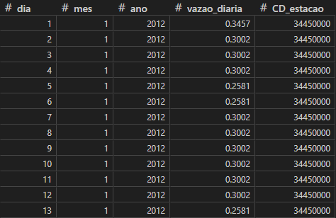
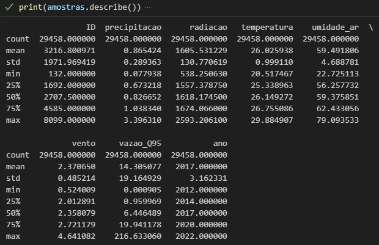
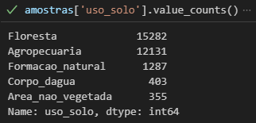

## 🛠️ Tratando os Dados

Na etapa anterior, foram obtidos dados de diferentes fontes. Agora, é necessário organizá-los e entender sua estrutura antes de utilizá-los nos modelos.

### 📌 1. Concatenando os Arquivos de Vazão
Os dados de vazão, obtidos por meio do plugin da **ANA (Agência Nacional de Águas)**, vieram em **múltiplos arquivos `.txt`** — um para cada gauge. Para consolidar as informações em um único **arquivo `.csv`**, foi necessário concatenar os dados.

🔹 **Processo realizado:**
- Os arquivos `.txt` foram armazenados na pasta `gauges_vazao/`.
- Utilizamos **Python** com as bibliotecas `os`, `pandas` e `numpy` para criar um DataFrame consolidado chamado **`DF_final_vazao`**.
- Durante o processo, **valores ausentes foram removidos** para evitar inconsistências.

📌 **Código utilizado:** [`scripts/codigo_concatenar_exemplo.py`](../scripts/codigo_concatenar_exemplo.py)

📊 **Recorte do resultado gerado:**

---

### 🌍 2. Interpolação Espacial das Variáveis Numéricas
Após o tratamento inicial, foi realizada a **interpolação espacial** dos dados de cada variável numérica por ano.

🔹 **Técnica utilizada:**
- **Método IDW (Inverse Distance Weighting)**, disponível no **QGIS**.
- O IDW gera **mapas interpolados**, atribuindo pesos às medições com base na proximidade dos pontos.
- Tutorial: VasGeo - Soluções em Geotecnologias 

---

### 📌 3. Amostragem Espacial dos Dados
Com os mapas interpolados das variáveis numéricas e os mapas classificados da variável categórica, foi realizada a **amostragem de dados**.

🔹 **Processo realizado:**
- Utilizou-se a ferramenta **"Criação de Pontos Regulares"** do **QGIS** para definir os pontos de amostragem.
- Os valores das variáveis foram extraídos das camadas raster geradas pela interpolação.
- Tutorial: TecnoGIS 

---

### 📊 4. Estatísticas Descritivas
Após a organização final dos dados, realizamos a análise estatística descritiva utilizando **Pandas**.

🔹 **Funções utilizadas:**
- `describe()` → Para variáveis **numéricas**.
- `value_counts()` → Para variáveis **categóricas**.

📈 **Resultados das estatísticas descritivas:**
- **Variáveis numéricas:**
  
- **Variáveis categóricas:**
  

---

### 🎯 Resumo do Processo
👉 **Concatenamos os arquivos de vazão em um único `.csv`** usando Python.
👉 **Interpolamos espacialmente os dados numéricos** com IDW no QGIS.
👉 **Criamos pontos de amostragem e extraímos valores das variáveis rasterizadas.**
👉 **Realizamos estatísticas descritivas para entender a distribuição dos dados.**

---

Agora os dados estão organizados e prontos para a **análise exploratória e modelagem!** 🚀

