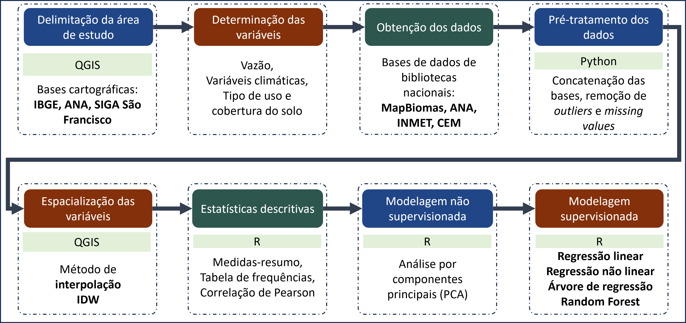

# q95_caatinga_saofrancisco
# Praticando Machine Learning com Dados Ambientais

## 📌 Sobre o Projeto
Este repositório apresenta um exemplo de trabalho em que dados ambientais coletados em diferentes plataformas de dados abertos foram estudados usando modelos não-supervisionados e supervisionados de machine learning.

## 🎯 Objetivo
Investigar o impacto dos fatores climáticos e do uso e cobertura do solo nas vazões de referência Q95 na porção da Caatinga dentro da Bacia Hidrográfica do São Francisco.

## 🔬 Metodologia
- Utilização da **Análise por Componentes Principais (PCA)** para explorar relações entre as variáveis explicativas.
- Aplicados quatro modelos supervisionados de machine learning:
  - **Regressão Linear Múltipla**
  - **Regressão Não Linear** (com transformação de Box-Cox)
  - **Árvore de Regressão**
  - **Random Forest**

## 🛠️ Ferramentas Utilizadas
- **QGIS** para manipulação de dados espaciais
- **Python** para data wranglilng e análise estatística 
- **RStudio** para modelagem e machine learning

## 🔄 Etapas do Trabalho
  
(*Figura ilustrando as etapas do trabalho*)

---
📂 Para mais detalhes, acesse as subpastas de cada etapa do projeto.

Se tiver dúvidas ou sugestões, fique à vontade para contribuir ou entrar em contato! 😊

